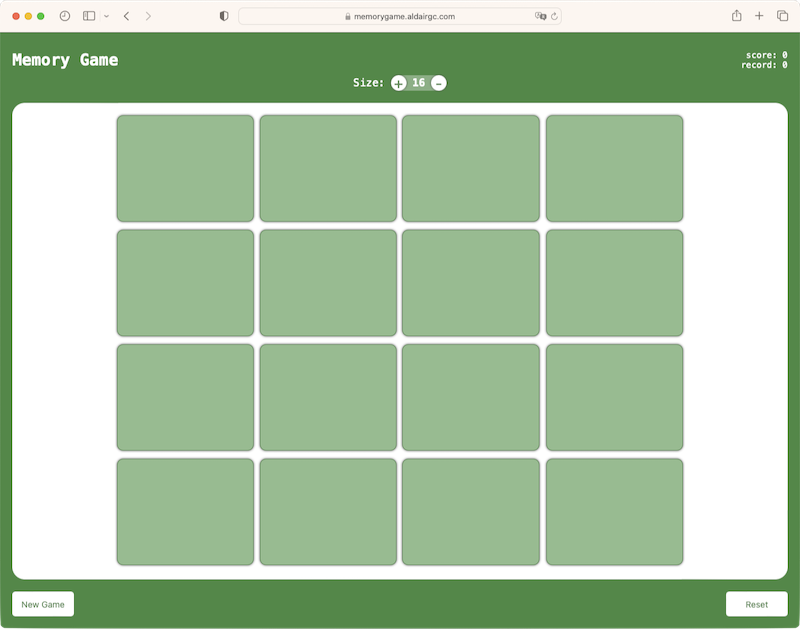

# MemoryGame

## Description

The project `MemoryGame`, is a pure javascript web application written using only Javascript, HTML and CSS.
It's just a simple game made to practice basic concepts and to have fun.
It's compatible with desktop and mobile devices.

## Getting Started

The following is recommended for the development environment:

1. Usage of [Visual Studio Code](https://code.visualstudio.com/) as IDE and the following plugins:
   - Prettier - Code formatter
   - LiveServer - Page Server
2. [GIT](https://git-scm.com/)

## Technologies

- HTML
- CSS
- JavaScript

## Folder Structure

```text
./apmes-frontend/
 ├── index.html          - project's index file
 ├── script.js           - all javascript code
 ├── style.css           - all css style code
 ├── .editorconfig       - editorconfig configutation file
 ├── .prettierrc.cjs     - prettier configuration file
 ├── desktop.png         - demo image file
 ├── mobile.png          - demo image file
 └── README.md           - content of this file
```

## Run

```bash
git clone https://github.com/aldair-gc/memoryGame.git
```

Open index.html with LiveServer by right-clicking on it.

## Status

Ready.

## Features

- [x] Multiple quantity of cards
- [x] Keeps record saved in browser's storage

## Demo



